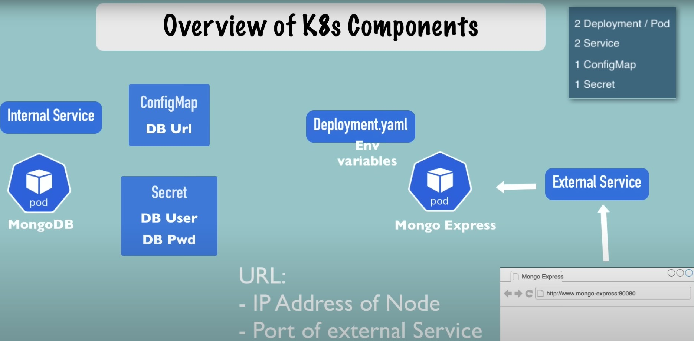

mongo-express
mongoDB

**SECRET** must be created prior to deployment
PS C:\WINDOWS\system32> cd C:\Users\ajayc\OneDrive\GITHub_Data\Kubernetes\Learn_Kubernetes\DemoProject_mongoDB
PS C:\Users\ajayc\OneDrive\GITHub_Data\Kubernetes\Learn_Kubernetes\DemoProject_mongoDB> kubectl apply -f .\mongo-secret.yaml
secret/mongodb-secret created

PS C:\Users\ajayc\OneDrive\GITHub_Data\Kubernetes\Learn_Kubernetes\DemoProject_mongoDB> kubectl get secret
NAME             TYPE     DATA   AGE
mongodb-secret   Opaque   2      54s

PS C:\Users\ajayc\OneDrive\GITHub_Data\Kubernetes\Learn_Kubernetes\DemoProject_mongoDB> kubectl apply -f .\config-file_mongoDB_deployment.yaml
deployment.apps/mongodb-deployment created

PS C:\Users\ajayc\OneDrive\GITHub_Data\Kubernetes\Learn_Kubernetes\DemoProject_mongoDB> kubectl get all
NAME                                      READY   STATUS         RESTARTS   AGE
pod/mongodb-deployment-7c64757c74-bvjkx   0/1     ErrImagePull   0          33s

NAME                 TYPE        CLUSTER-IP   EXTERNAL-IP   PORT(S)   AGE
service/kubernetes   ClusterIP   10.96.0.1    <none>        443/TCP   39d

NAME                                 READY   UP-TO-DATE   AVAILABLE   AGE
deployment.apps/mongodb-deployment   0/1     1            0           33s

NAME                                            DESIRED   CURRENT   READY   AGE
replicaset.apps/mongodb-deployment-7c64757c74   1         1         0       33s

PS C:\Users\ajayc\OneDrive\GITHub_Data\Kubernetes\Learn_Kubernetes\DemoProject_mongoDB> kubectl get pod
NAME                                  READY   STATUS             RESTARTS   AGE
mongodb-deployment-7c64757c74-bvjkx   0/1     ImagePullBackOff   0          82s

PS C:\Users\ajayc\OneDrive\GITHub_Data\Kubernetes\Learn_Kubernetes\DemoProject_mongoDB> kubectl apply -f .\config-file_mongoDB_deployment.yaml
deployment.apps/mongodb-deployment configured
PS C:\Users\ajayc\OneDrive\GITHub_Data\Kubernetes\Learn_Kubernetes\DemoProject_mongoDB> kubectl get pod
NAME                                  READY   STATUS             RESTARTS   AGE
mongodb-deployment-7c64757c74-bvjkx   0/1     ImagePullBackOff   0          4m52s
PS C:\Users\ajayc\OneDrive\GITHub_Data\Kubernetes\Learn_Kubernetes\DemoProject_mongoDB> kubectl get pod
NAME                                  READY   STATUS             RESTARTS   AGE
mongodb-deployment-7c64757c74-bvjkx   0/1     ImagePullBackOff   0          5m
PS C:\Users\ajayc\OneDrive\GITHub_Data\Kubernetes\Learn_Kubernetes\DemoProject_mongoDB> kubectl get pod
NAME                                  READY   STATUS             RESTARTS   AGE
mongodb-deployment-7c64757c74-bvjkx   0/1     ImagePullBackOff   0          5m14s
PS C:\Users\ajayc\OneDrive\GITHub_Data\Kubernetes\Learn_Kubernetes\DemoProject_mongoDB> kubectl apply -f .\config-file_mongoDB_deployment.yaml
deployment.apps/mongodb-deployment configured
PS C:\Users\ajayc\OneDrive\GITHub_Data\Kubernetes\Learn_Kubernetes\DemoProject_mongoDB> kubectl get pod
NAME                                  READY   STATUS        RESTARTS   AGE
mongodb-deployment-6d9d7c68f6-8pq2x   1/1     Running       0          2s
mongodb-deployment-7c64757c74-bvjkx   0/1     Terminating   0          6m30s
PS C:\Users\ajayc\OneDrive\GITHub_Data\Kubernetes\Learn_Kubernetes\DemoProject_mongoDB> kubectl get pod
NAME                                  READY   STATUS    RESTARTS   AGE
mongodb-deployment-6d9d7c68f6-8pq2x   1/1     Running   0          49s
PS C:\Users\ajayc\OneDrive\GITHub_Data\Kubernetes\Learn_Kubernetes\DemoProject_mongoDB> kubectl get all
NAME                                      READY   STATUS    RESTARTS   AGE
pod/mongodb-deployment-6d9d7c68f6-8pq2x   1/1     Running   0          82s

NAME                 TYPE        CLUSTER-IP   EXTERNAL-IP   PORT(S)   AGE
service/kubernetes   ClusterIP   10.96.0.1    <none>        443/TCP   39d

NAME                                 READY   UP-TO-DATE   AVAILABLE   AGE
deployment.apps/mongodb-deployment   1/1     1            1           7m50s

NAME                                            DESIRED   CURRENT   READY   AGE
replicaset.apps/mongodb-deployment-6d9d7c68f6   1         1         1       82s
replicaset.apps/mongodb-deployment-7c64757c74   0         0         0       7m50s

PS C:\Users\ajayc\OneDrive\GITHub_Data\Kubernetes\Learn_Kubernetes\DemoProject_mongoDB> kubectl get pod --watch
NAME                                  READY   STATUS    RESTARTS   AGE
mongodb-deployment-6d9d7c68f6-8pq2x   1/1     Running   0          2m25s

PS C:\Users\ajayc\OneDrive\GITHub_Data\Kubernetes\Learn_Kubernetes\DemoProject_mongoDB> kubectl apply -f .\mongo.yaml
deployment.apps/mongodb-deployment unchanged
service/mongodb-service created
PS C:\Users\ajayc\OneDrive\GITHub_Data\Kubernetes\Learn_Kubernetes\DemoProject_mongoDB> kubectl get pod
NAME                                  READY   STATUS    RESTARTS   AGE
mongodb-deployment-6d9d7c68f6-8pq2x   1/1     Running   0          10m
PS C:\Users\ajayc\OneDrive\GITHub_Data\Kubernetes\Learn_Kubernetes\DemoProject_mongoDB> kubectl get service
NAME              TYPE        CLUSTER-IP      EXTERNAL-IP   PORT(S)     AGE
kubernetes        ClusterIP   10.96.0.1       <none>        443/TCP     39d
mongodb-service   ClusterIP   10.97.130.222   <none>        27017/TCP   32s

PS C:\Users\ajayc\OneDrive\GITHub_Data\Kubernetes\Learn_Kubernetes\DemoProject_mongoDB> kubectl apply -f .\mongo-configmap.yaml
configmap/mongodb-configmap created
PS C:\Users\ajayc\OneDrive\GITHub_Data\Kubernetes\Learn_Kubernetes\DemoProject_mongoDB> kubectl apply -f .\mongo-express.yaml
deployment.apps/mongo-express-deployment created
service/mongo-express-service created
PS C:\Users\ajayc\OneDrive\GITHub_Data\Kubernetes\Learn_Kubernetes\DemoProject_mongoDB> kubectl get pod
NAME                                        READY   STATUS    RESTARTS   AGE
mongo-express-deployment-5dd87b9fcf-2gw7q   1/1     Running   0          28s
mongodb-deployment-6d9d7c68f6-8pq2x         1/1     Running   0          38m

PS C:\Users\ajayc\OneDrive\GITHub_Data\Kubernetes\Learn_Kubernetes\DemoProject_mongoDB> kubectl logs mongo-express-deployment-5dd87b9fcf-2gw7q
Waiting for mongo:27017...
No custom config.js found, loading config.default.js
Welcome to mongo-express 1.0.2
------------------------

Mongo Express server listening at http://0.0.0.0:8081
←[31mServer is open to allow connections from anyone (0.0.0.0)←[39m
←[31mbasicAuth credentials are "admin:pass", it is recommended you change this in your config.js!←[39m

PS C:\Users\ajayc\OneDrive\GITHub_Data\Kubernetes\Learn_Kubernetes\DemoProject_mongoDB> kubectl get service
NAME                    TYPE           CLUSTER-IP       EXTERNAL-IP   PORT(S)          AGE
kubernetes              ClusterIP      10.96.0.1        <none>        443/TCP          39d
mongo-express-service   LoadBalancer   10.102.243.235   <pending>     8081:30000/TCP   46s
mongodb-service         ClusterIP      10.97.130.222    <none>        27017/TCP        28m

PS C:\Users\ajayc\OneDrive\GITHub_Data\Kubernetes\Learn_Kubernetes\DemoProject_mongoDB> minikube service mongo-express-service
|-----------|-----------------------|-------------|--------------------------|
| NAMESPACE |         NAME          | TARGET PORT |           URL            |
|-----------|-----------------------|-------------|--------------------------|
| default   | mongo-express-service |        8081 | http://172.26.0.39:30000 |
|-----------|-----------------------|-------------|--------------------------|
* Opening service default/mongo-express-service in default browser...