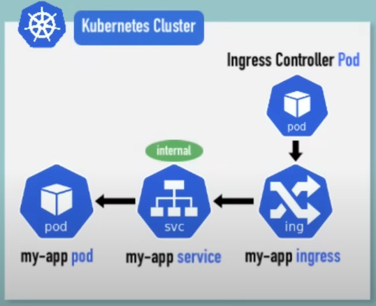
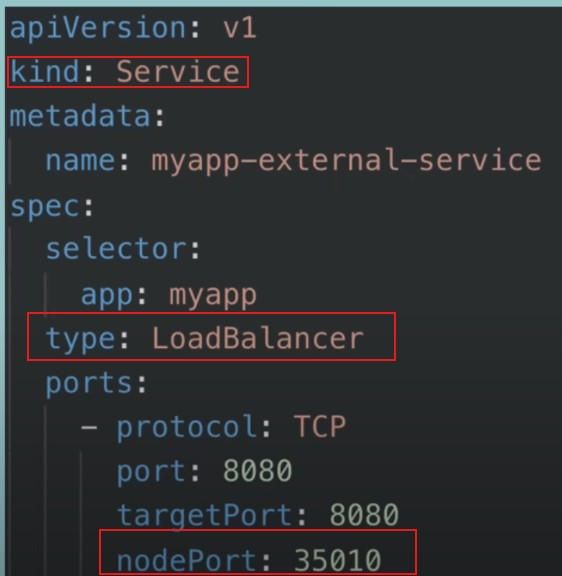
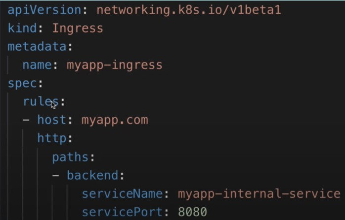
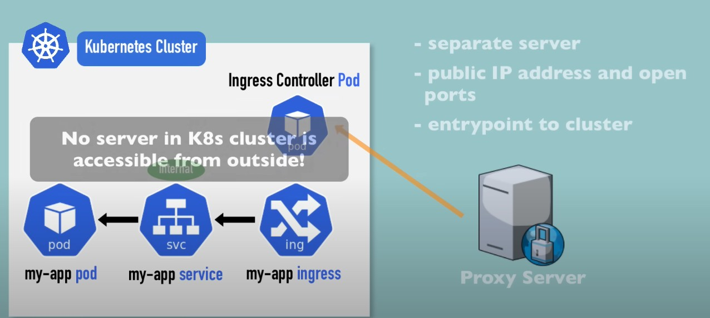
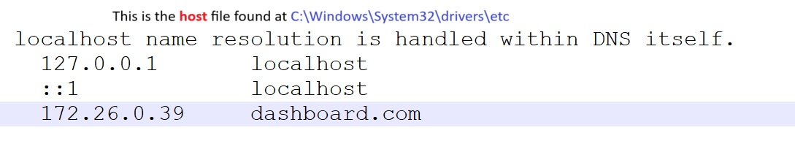
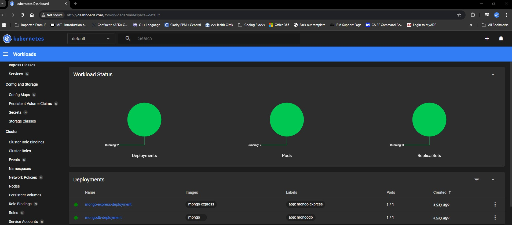

# Overview how things will look like finally


# What is Ingress ?
    K8s cluster very simply have:
        (i) POD that is running the application
        (ii) SERVICE that ensures we can reach to the POD running the application. 

            SERVICE can be categorized into:
                - EXTERNAL : world outside K8s cluster can reach to our application e.g. http://172.168.0.0:12345 
                - INTERNAL : only the components/resources inside the K8s cluster are allowed to access our app.

**Roadblocks**: The external service is mentioned to be reachable by an IP address, however :
- http is used but not secured https
- Its very inconvinient to provide IP address to the outerworld and ask them to use it rather everybody prefers a domain name like https://my-app.com
    
> Solution : INGRESS - IP address and port are not opened or exposed to outer world

# Ingress YAML Configuration

|EXTERNAL SERVICE|INGRESS|
|----------------|-------|
|||
|Kind:Service|Kind:Ingress|
|type:LoadBalance|NA|
|nodePort:35010 i.e. where your application can be reached at while using IP|NA|

## Details about YAML config file for Ingress
  - kind : Ingress -> This is static value that tells K8s cluster that this file is for INGRESS configuration
  - spec section ->This can be understood as a section that explains the ROUTING RULES 
    - host : The DNS name at which application is reachable.
      - It should be a valid domain address
      - Domain name must be mapped to Node's IP address i.e. the entry point.
        - If one of the nodes in K8s cluster is the entry point then IP address of that node must be configured with domain name.
        - If one of the servers that acts as entry point and is hosted outside of K8s cluster, even then IP address of this outside server should be mapped to domain name
      - _For testing purpose, we can map it in hosts file on our system_.
    
    - backend : When a request is request, where should this request be sent to i.e. Explains forwarding of request to an Internal service.
    
    - http : This doesn't mean that http protocol is used by outer world to reach to Ingress rather it is the protocol used for forwarding the request to Internal service within K8s cluster.
    - 

# INGRESS CONTROLLER 

> Creating an INGRESS via YAML configuration file doesn't suffice the overall task of moving. We need an _implementation_ for Ingress. Implementation is called **INGRESS CONTROLLER**.

## Ingress Controller
- Another POD that runs within K8s cluster
- Evaluates and process the Ingress rules i.e. manager the redirections
- many third party implementations exist that function as Ingress Controller
  -  K8s Nginx Ingress Controller (default or provided by K8s itself)

> **Cluster entry point**

    **Note**: In cloud implementations, cloud providers may provide their own load balancer that can act as entry point.


# Install Ingress Controller in minikube
```minikube addons enable ingress```
```
PS C:\Users\ajayc\OneDrive\GITHub_Data\Kubernetes\Learn_Kubernetes> minikube addons enable ingress
* ingress is an addon maintained by Kubernetes. For any concerns contact minikube on GitHub.
You can view the list of minikube maintainers at: https://github.com/kubernetes/minikube/blob/master/OWNERS
  - Using image registry.k8s.io/ingress-nginx/kube-webhook-certgen:v1.4.4
  - Using image registry.k8s.io/ingress-nginx/controller:v1.11.3
  - Using image registry.k8s.io/ingress-nginx/kube-webhook-certgen:v1.4.4
* Verifying ingress addon...
* The 'ingress' addon is enabled
```
> kubectl get pods --all-namespaces
```
    PS C:\Users\ajayc\OneDrive\GITHub_Data\Kubernetes\Learn_Kubernetes> kubectl get pods --all-namespaces
    NAMESPACE              NAME                                         READY   STATUS      RESTARTS        AGE
    default                mongo-express-deployment-5dd87b9fcf-2gw7q    1/1     Running     0               22h
    default                mongodb-deployment-6d9d7c68f6-8pq2x          1/1     Running     0               23h
    ingress-nginx          ingress-nginx-admission-create-mkpf8         0/1     Completed   0               20m
    ingress-nginx          ingress-nginx-admission-patch-pq9cq          0/1     Completed   0               20m
    ingress-nginx          ingress-nginx-controller-56d7c84fd4-dzjz6    1/1     Running     0               20m
    kube-system            coredns-668d6bf9bc-k96bd                     1/1     Running     1 (43h ago)     40d
    kube-system            etcd-minikube                                1/1     Running     0               43h
    kube-system            kube-apiserver-minikube                      1/1     Running     0               43h
    kube-system            kube-controller-manager-minikube             1/1     Running     1 (43h ago)     40d
    kube-system            kube-proxy-8wlb5                             1/1     Running     1 (43h ago)     40d
    kube-system            kube-scheduler-minikube                      1/1     Running     1 (43h ago)     40d
    kube-system            storage-provisioner                          1/1     Running     164 (7h ago)    40d
    kubernetes-dashboard   dashboard-metrics-scraper-5d59dccf9b-2z6kt   1/1     Running     1 (43h ago)     40d
    kubernetes-dashboard   kubernetes-dashboard-7779f9b69b-6cdzx        1/1     Running     157 (43h ago)   40d
```
### Get all namespace availalbe

```kubectl get ns```
```
PS C:\Users\ajayc\OneDrive\GITHub_Data\Kubernetes\Learn_Kubernetes> kubectl get ns
NAME                   STATUS   AGE
default                Active   40d
ingress-nginx          Active   22m
kube-node-lease        Active   40d
kube-public            Active   40d
kube-system            Active   40d
kubernetes-dashboard   Active   40d
```

### Get all services that are running in a namespace "kubernetes-dashboard"
``` kubectl get all -n kubernetes-dashboard ```
```
PS C:\Users\ajayc\OneDrive\GITHub_Data\Kubernetes\Learn_Kubernetes> kubectl get all -n kubernetes-dashboard
NAME                                             READY   STATUS    RESTARTS        AGE
pod/dashboard-metrics-scraper-5d59dccf9b-2z6kt   1/1     Running   1 (43h ago)     40d
pod/kubernetes-dashboard-7779f9b69b-6cdzx        1/1     Running   157 (43h ago)   40d

NAME                                TYPE        CLUSTER-IP      EXTERNAL-IP   PORT(S)    AGE
service/dashboard-metrics-scraper   ClusterIP   10.110.204.72   <none>        8000/TCP   40d
service/kubernetes-dashboard        ClusterIP   10.105.171.93   <none>        80/TCP     40d

NAME                                        READY   UP-TO-DATE   AVAILABLE   AGE
deployment.apps/dashboard-metrics-scraper   1/1     1            1           40d
deployment.apps/kubernetes-dashboard        1/1     1            1           40d

NAME                                                   DESIRED   CURRENT   READY   AGE
replicaset.apps/dashboard-metrics-scraper-5d59dccf9b   1         1         1       40d
replicaset.apps/kubernetes-dashboard-7779f9b69b        1         1         1       40d

```
---
> Internal Service and POD are already running.. however we can't access dashboard from outside.
> So, as a goal we will create ingress rule to access the kubenetes dashboard from our browser i,e, outside K8s cluster

YAML file
```
apiVersion: networking.k8s.io/v1
kind: Ingress
metadata:
  name: dashboard-ingress
  namespace: kubernetes-dashboard
spec:
  rules:
  - host: dashboard.com
    http:
      paths:
      - path: /
        pathType: Prefix
        backend:
          service:
            name: kubernetes-dashboard
            port: 
              number: 80
```
PS C:\Users\ajayc\OneDrive\GITHub_Data\Kubernetes\Learn_Kubernetes\K8s_Dashboard_usingIngress> kubectl apply -f .\dashboard-ingress.yaml
ingress.networking.k8s.io/dashboard-ingress created
PS C:\Users\ajayc\OneDrive\GITHub_Data\Kubernetes\Learn_Kubernetes\K8s_Dashboard_usingIngress> 

PS C:\Users\ajayc\OneDrive\GITHub_Data\Kubernetes\Learn_Kubernetes\K8s_Dashboard_usingIngress> kubectl get ingress -n kubernetes-dashboard
NAME                CLASS   HOSTS           ADDRESS       PORTS   AGE
dashboard-ingress   nginx   dashboard.com   172.26.0.39   80      2m33s

# Register DNS locally only on your laptop



