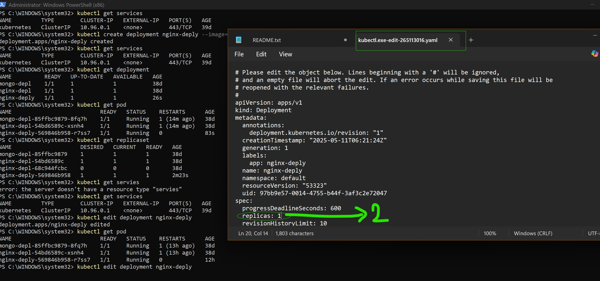
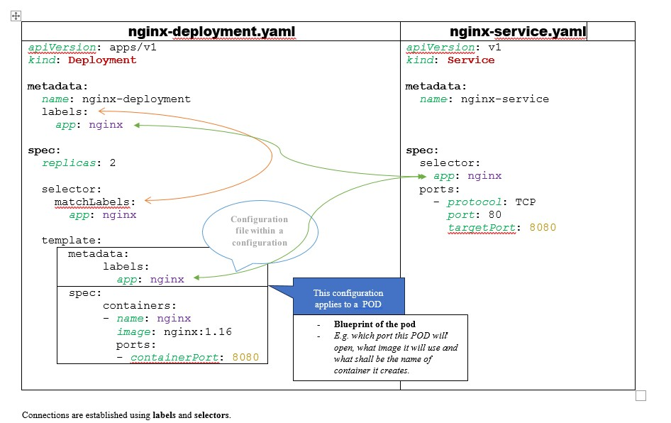

# Learn_Kubernetes
My Kubernetes learning path

youtube video link : https://www.youtube.com/watch?v=X48VuDVv0do&t=3365s

Topics covered:
==============


|             Introduction                      |                   Advanced Topics                     |
|:----------------------------------------------|:------------------------------------------------------|
|    i.  What is Kubernetes                     |       i. K8s Namespaces - Organize your components    |
|    ii. Main K8s Components                    |       ii. K8s Ingress                                 |
|    iii.K8s Architecture                       |       iii.Helm - Package Manager                      |
|    iv. Minikube and Kubectl - Local Setup     |       iv. Volumes - Persisting Data in K8s            |
|    v.  Main Kubectl commands - K8s CLI        |       v.  K8s StatefulSet - Deploying Stateful Apps   |
|    vi. K8s YAML Configuration File            |       vi. K8s Services                                |


_________________________________________________________________________________________________________

# 1. What is Kubernetes
    Open source Container Orchestration tool
    i.e. Help in managing containerized applications in different deployment enviornments

    Why needed - Trend from Monolith to microservices... So there came a need where we can manage these microservces in better name than manual script runs.
    Features
        -  High availability or no downtime
        -  Scalability or high performace
        -  Disaster Recovery - Backup and restore

_________________________________________________________________________________________________________

# 2. Main K8s Components

##  POD
        - Smallest unit of K9s
        - Abstraction over container
        - Usually 1 application per pod
        - Each pod gets its own IP address - internal IP address
        - New IP address is assigned anytime pod is re-created. 
          - So, we can't rely on IPs alone to allow Pod communication with a node

##  SERVICE & INGRESS
    SERVICE
      - Permanent or static IP address attached to a pod
      - Lifecycle of SERVICE is not connected with POD i.e. if a POD goes down, the SERVICE (or static IP address still remains valid)
      - So, if pod is recreated,the preexisting SERVICE can be utlized to access the newly created POD is same way as before.
      - Types
        - EXTERNAL : When we want application to be accessible from browser i.e. from internet (outside of this K8s architecure)
        - INTERNAL : When we want application or resources like DB to be only allowed to access from internal K8s architecture.
      - Also, acts as Load Balancer to route request among available replicasets of the pod.

    * INGRESS
      - Provides a user friendly dns or address for use with EXTERNAL SERVICE.
      - External world ==> Ingress ==> routes or forwards it to ==> External Service ==> your Application running in pod

    

* ConfigMap and Secret
  - DB end point : mondo-db-service
  - DB url usually lies in built application
  - if changes
- Secret
  - base64 encoded
  - passwords and certificates
- Use it as env variable or properties file


* Volumes - attaches a physical storage to your pod
  - **K8s doesn't manage data persistance. User or administator of cluster are responsible for data storage.**
  - Local i.e. stored locally on node within K8s 
  - Remote  - i.e. outside of K8s cluster e.g. on-premise

* Deployment
  - *Blueprint* for the application pods (**NOTE** : I didn't say database pods.)
    - i.e. Abstraction of Pods
  - In real world scenario, we create deployments rather than creating pods directly.
  - Why Databases can't be replicated through *Deployment*
    - Databases are Stateful applications i.e. they have a state (data)
    - So, there needs to be a some kind of mechanism where each node can access a common storage which is kept upto date for IO operations happening in DB inside nodes.

* StatefulSet 
  - *Blueprint* for the database pods
  - Ensures to keep track which pod is writing or reading data from the database. Thus eliminates data inconsistencies
  - not easy task 
    - DBs are often hosted outside of K8s cluster
 


_________________________________________________________________________________________________________

# 3. K8s Architecture

## Node Processes

3 Processess must be installed on every Node (worker node)

Container runtime (e.g. Docker)
Kubelet - Process that schedeudles those pods or containers underneath
  interacts with both the container as well the node.
  responsible for tking the configuraton and starting the pod or basically starting the container inside
  assigning resources like CPU or memory for running 

Kube Proxy 
  intelligent forwarding logic
  communication works in a perfomant way with  low overhead


How to or who 
  - Schedule a pod ?
  - monitor
  - re-schedule or restart the pd
  - add a new node to the cluster ? 
Anser : Master node  
Master node
  4 processees run on every master node that control cluster state and the worker nodes

API Server
  - Cluster gateway - Single entry point tot the cluster
  - Update or query requests are received here from the CLIENT
    - Update means - scheduling a pod or change the state
    - query means - querying the state of a pod
  - acts as gatekeeper for authentication

Scheduler
  - So lets see we want to schedule a new pod
  - Client sends that request --- API server receives it - performs the authentication and safeguarding steps - sends it to Scheduler
  - Scheduler performs:
    - Analyze the new pod being requested requires what kind of resources e..g how much CPU and RAM.
    - It then scans all running NODES to evaluate their stats i.e. their running capacity
    - Based on above tow steps , SCHEDULER identifies that a NODE_X is the suitable choice for running this new POD
    - **SCHEDULER just decides where the new POD should be scheduled, it doesn't actually start or provision the node**
      - The real task is of KUBELET in corresponding WORKER node to start the pod.

CONTROLLER MANAGER
  - node dies on any node
  - detect state changes of the cluster
  - Contoller Manager --> Scheduler for scheduling the lost pods

ETCD
  - cluster brain (KEY VALUE Store)
  - every change in the cluster are stored in keyvalus store here.. this is the data stogage of cluster for management operation
  - data stored is used by master process to keep the cluster healthy
  - Application data is not stored in ETCD !!

K8s cluster
  - multiple master nodes too
    - API server is load balances
    - ETCD is distributed storage across all master nodes


______________________________________________________________________________________________________________________________

# Minikube

1 Node K8s Cluster
Creates virtual box on your machine/laptop
Docker is preinstalled as container runtime
Node runs in that virtual box
  - Virtulaization is needed

https://minikube.sigs.k8s.io/docs/start/?arch=%2Fwindows%2Fx86-64%2Fstable%2F.exe+download


# kubectl
  command line tool for K8s cluster

------------------------------------------------------------
## Start the powershell as admin
- Start the cluster
  >minikube start -driver=hyperv


- Get the status of nodes
  >kubectl get nodes
    ```
    NAME       STATUS   ROLES           AGE   VERSION
    minikube   Ready    control-plane   39d   v1.32.0 
    ```


- Get the status of MINIKUBE
  >minikube staus
    ```
    PS C:\WINDOWS\system32> minikube status
    
    OUTPUT:
      minikube
      type: Control Plane
      host: Running
      kubelet: Running
      apiserver: Running
      kubeconfig: Configured
    ```


- Check the version
  > kubectl version
  ```
  PS C:\WINDOWS\system32> kubectl version
  
  OUTPUT:
    Client Version: v1.32.2
    Kustomize Version: v5.5.0
    Server Version: v1.32.0
  ```


- Check the services running on minikube cluster  **- A Service is a method for exposing a network application that is running as one or more Pods in your cluster**
  > kubectl get services
  ```
  PS C:\WINDOWS\system32> kubectl get services
  
  OUTPUT:
    NAME         TYPE        CLUSTER-IP   EXTERNAL-IP   PORT(S)   AGE
    kubernetes   ClusterIP   10.96.0.1    <none>        443/TCP   39d
  ```


- Create a blueprint i.e. deployment for an application to run in K8s
  > kubectl create deployment nginx-deply --image=nginx
  
  > Command format : kubectl create deployment my_name --image=imagename_from_DOCKERHUB
  
  ```
  PS C:\WINDOWS\system32> kubectl create deployment nginx-deply --image=nginx

  Output:
    deployment.apps/nginx-deply created
  ```


- Get listing of Deployment created in this K8s cluster
  > kubectl get deployment
  ```
  PS C:\WINDOWS\system32> kubectl get deployment

  OUTPUT:
    NAME          READY   UP-TO-DATE   AVAILABLE   AGE
    mongo-depl    1/1     1            1           38d
    nginx-depl    1/1     1            1           38d
    nginx-deply   1/1     1            1           26s    <This is just created in step above>
  ```


- ReplicaSet
 
  _In Kubernetes, a ReplicaSet is a control loop that ensures a specific number of identical pods (containers) are running at any given time. It's a key component for maintaining the desired state of your application by automatically creating, deleting, and scaling pods as needed. ReplicaSets are typically managed by Deployments, which are higher-level constructs that provide declarative updates and other useful features._

  > kubectl get replicaset   
  ```
  PS C:\WINDOWS\system32> kubectl get replicaset

  OUTPUT:
    NAME                     DESIRED   CURRENT   READY   AGE
    mongo-depl-85ffbc9879    1         1         1       38d
    nginx-depl-54bd6589c     1         1         1       38d
    nginx-depl-68c944fcbc    0         0         0       38d
    nginx-deply-569846b958   1         1         1       2m23s
  ```


- Get listing of PODS active on this K8s
  > kubectl get pod
  ```
  PS C:\WINDOWS\system32> kubectl get pod

  OUTPUT:

    NAME                           READY   STATUS    RESTARTS      AGE
    mongo-depl-85ffbc9879-8fq7h    1/1     Running   1 (14m ago)   38d
    nginx-depl-54bd6589c-xsnh4     1/1     Running   1 (14m ago)   38d
    nginx-deply-569846b958-r7ss7   1/1     Running   0             83s
  ```

    ```
      Look at the naming convention of Deployment vs ReplicaSet vs POD 
        Deployment  =   nginx-deply
        ReplicaSet  =   nginx-deply-569846b958
        Pod         =   nginx-deply-569846b958-r7ss7  
    ```

- Edit Deployment
  Deployment or blueprint is the only thing that user should be managing to configure what image should be used, number of replica pods needed etc. Rest anything or everything below Deployment is managed by K8s itself.

  > kubectl edit deployment nginx-deply

  ```
  PS C:\WINDOWS\system32> kubectl edit deployment nginx-deply

  OUTPUT:
    It opens a YAML file for making changes
    
    deployment.apps/nginx-deply edited
  ```
    
  
    > What changed in the deployment configuration file - Increased the replicaSet from 1 to 2
    ```
        PS C:\WINDOWS\system32> kubectl edit deployment nginx-deply
          deployment.apps/nginx-deply edited
    ```
    ```

      PS C:\WINDOWS\system32> kubectl get pod

      NAME                           READY   STATUS    RESTARTS      AGE
        mongo-depl-85ffbc9879-8fq7h    1/1     Running   1 (13h ago)   38d
        nginx-depl-54bd6589c-xsnh4     1/1     Running   1 (13h ago)   38d
        nginx-deply-569846b958-mvrfn   1/1     Running   0             5s  <!new!>
        nginx-deply-569846b958-r7ss7   1/1     Running   0             12h
    ```


- Look into the logs
  > kubectl logs pod_name
  ```
    PS C:\WINDOWS\system32> kubectl logs nginx-deply-569846b958-r7ss7
    OUTPUT:
      /docker-entrypoint.sh: /docker-entrypoint.d/ is not empty, will attempt to perform configuration
      /docker-entrypoint.sh: Looking for shell scripts in /docker-entrypoint.d/
      /docker-entrypoint.sh: Launching /docker-entrypoint.d/10-listen-on-ipv6-by-default.sh
      10-listen-on-ipv6-by-default.sh: info: Getting the checksum of /etc/nginx/conf.d/default.conf
      10-listen-on-ipv6-by-default.sh: info: Enabled listen on IPv6 in /etc/nginx/conf.d/default.conf
      /docker-entrypoint.sh: Sourcing /docker-entrypoint.d/15-local-resolvers.envsh
      /docker-entrypoint.sh: Launching /docker-entrypoint.d/20-envsubst-on-templates.sh
      /docker-entrypoint.sh: Launching /docker-entrypoint.d/30-tune-worker-processes.sh
      /docker-entrypoint.sh: Configuration complete; ready for start up
      2025/05/11 06:21:36 [notice] 1#1: using the "epoll" event method
      2025/05/11 06:21:36 [notice] 1#1: nginx/1.27.5
      2025/05/11 06:21:36 [notice] 1#1: built by gcc 12.2.0 (Debian 12.2.0-14)
      2025/05/11 06:21:36 [notice] 1#1: OS: Linux 5.10.207
      2025/05/11 06:21:36 [notice] 1#1: getrlimit(RLIMIT_NOFILE): 1048576:1048576
      2025/05/11 06:21:36 [notice] 1#1: start worker processes
      2025/05/11 06:21:36 [notice] 1#1: start worker process 30
      2025/05/11 06:21:36 [notice] 1#1: start worker process 31
  ```


- Access the terminal of the pod
  > kubectl exec -it pod_name --bin/base
  ```
    PS C:\WINDOWS\system32> kubectl exec -it nginx-deply-569846b958-r7ss7 -- bin/bash
    
    OUTPUT:
      root@nginx-deply-569846b958-r7ss7:/#
  ```


- Deleting a deployment
  > kubectl delete deployment deployment_name
  ```
    PS C:\WINDOWS\system32> kubectl get deployment
    NAME          READY   UP-TO-DATE   AVAILABLE   AGE
    mongo-depl    1/1     1            1           38d
    nginx-depl    1/1     1            1           38d
    nginx-deply   2/2     2            2           13h

    PS C:\WINDOWS\system32> kubectl delete deployment nginx-depl
    deployment.apps "nginx-depl" deleted

    PS C:\WINDOWS\system32> kubectl get deployment
    NAME          READY   UP-TO-DATE   AVAILABLE   AGE
    mongo-depl    1/1     1            1           38d
    nginx-deply   2/2     2            2           13h

    PS C:\WINDOWS\system32> kubectl get pod
    NAME                           READY   STATUS    RESTARTS      AGE
    mongo-depl-85ffbc9879-8fq7h    1/1     Running   1 (13h ago)   38d
    nginx-deply-569846b958-mvrfn   1/1     Running   0             14m
    nginx-deply-569846b958-r7ss7   1/1     Running   0             13h  
  ```


- Heading
  > Command
  ```
    actual command
    
    OUTPUT:
      output of the command
  ```


# Configuration file YAML
> kubectl apply -f file_name.yaml
  If the deployment/service mentioned in the config file doesn't exist then it gets createsd but if exists then it get updated.

> kubectl apply -f config-file_nginx_deployment.yaml


> kubectl apply -f config-file_nginx_deployment.yaml
  


C:\Users\ajayc\OneDrive\GITHub_Data\Kubernetes\Learn_Kubernetes\config-file_nginx_deployment.yaml
PS C:\WINDOWS\system32> kubectl apply -f C:\Users\.......\Kubernetes\Learn_Kubernetes\config-file_nginx_deployment.yaml
deployment.apps/nginx-deployment created


PS C:\WINDOWS\system32> kubectl apply -f C:\Users\ajayc\OneDrive\GITHub_Data\Kubernetes\Learn_Kubernetes\config-file_nginx_service.yaml
service/nginx-service created
PS C:\WINDOWS\system32>
PS C:\WINDOWS\system32> kubectl get deployment
NAME               READY   UP-TO-DATE   AVAILABLE   AGE
mongo-depl         1/1     1            1           38d
nginx-deployment   3/3     3            3           85s
nginx-deply        2/2     2            2           13h
PS C:\WINDOWS\system32>
PS C:\WINDOWS\system32> kubectl get service
NAME            TYPE        CLUSTER-IP      EXTERNAL-IP   PORT(S)   AGE
kubernetes      ClusterIP   10.96.0.1       <none>        443/TCP   39d
nginx-service   ClusterIP   10.96.244.145   <none>        80/TCP    38s


PS C:\WINDOWS\system32> kubectl describe service nginx-service
Name:                     nginx-service
Namespace:                default
Labels:                   <none>
Annotations:              <none>
Selector:                 app=nginx
Type:                     ClusterIP
IP Family Policy:         SingleStack
IP Families:              IPv4
IP:                       10.96.244.145
IPs:                      10.96.244.145
Port:                     <unset>  80/TCP
TargetPort:               8080/TCP
Endpoints:                10.244.0.17:8080,10.244.0.16:8080,10.244.0.15:8080
Session Affinity:         None
Internal Traffic Policy:  Cluster
Events:                   <none>
PS C:\WINDOWS\system32>

PS C:\WINDOWS\system32> kubectl get pod -o wide
NAME                                READY   STATUS    RESTARTS      AGE    IP            NODE       NOMINATED NODE   READINESS GATES
mongo-depl-85ffbc9879-8fq7h         1/1     Running   1 (14h ago)   38d    10.244.0.11   minikube   <none>           <none>
nginx-deployment-844bd9fb9b-4lqcm   1/1     Running   0             4m7s   10.244.0.16   minikube   <none>           <none>
nginx-deployment-844bd9fb9b-8l7vl   1/1     Running   0             4m7s   10.244.0.15   minikube   <none>           <none>
nginx-deployment-844bd9fb9b-dp9vw   1/1     Running   0             4m7s   10.244.0.17   minikube   <none>           <none>
nginx-deply-569846b958-mvrfn        1/1     Running   0             72m    10.244.0.14   minikube   <none>           <none>
nginx-deply-569846b958-r7ss7        1/1     Running   0             14h    10.244.0.13   minikube   <none>           <none>
PS C:\WINDOWS\system32>

- Cleanup
> kubectl delete deployment deployment_name
  ```
    PS C:\WINDOWS\system32> kubectl get deployment
    NAME               READY   UP-TO-DATE   AVAILABLE   AGE
    mongo-depl         1/1     1            1           38d
    nginx-deployment   3/3     3            3           5h11m
    nginx-deply        2/2     2            2           19h

    PS C:\WINDOWS\system32> kubectl delete deployment mongo-depl
    deployment.apps "mongo-depl" deleted

    PS C:\WINDOWS\system32> kubectl delete deployment nginx-deployment
    deployment.apps "nginx-deployment" deleted

    PS C:\WINDOWS\system32> kubectl delete deployment nginx-deply
    deployment.apps "nginx-deply" deleted

    
    PS C:\WINDOWS\system32> kubectl get deployment
    No resources found in default namespace.
    
    PS C:\WINDOWS\system32> kubectl get pods
    No resources found in default namespace.
    
    PS C:\WINDOWS\system32> kubectl get replicaSet
    No resources found in default namespace.
  ```
  > kubectl delete service service_name
  ```
    PS C:\WINDOWS\system32> kubectl get all
    NAME                    TYPE        CLUSTER-IP      EXTERNAL-IP   PORT(S)   AGE
    service/kubernetes      ClusterIP   10.96.0.1       <none>        443/TCP   39d
    service/nginx-service   ClusterIP   10.96.244.145   <none>        80/TCP    5h12m

    PS C:\WINDOWS\system32> kubectl get service
    NAME            TYPE        CLUSTER-IP      EXTERNAL-IP   PORT(S)   AGE
    kubernetes      ClusterIP   10.96.0.1       <none>        443/TCP   39d
    nginx-service   ClusterIP   10.96.244.145   <none>        80/TCP    5h12m
    
    PS C:\WINDOWS\system32> kubectl delete service nginx-service
    service "nginx-service" deleted

    PS C:\WINDOWS\system32> kubectl get all
    NAME                 TYPE        CLUSTER-IP   EXTERNAL-IP   PORT(S)   AGE
    service/kubernetes   ClusterIP   10.96.0.1    <none>        443/TCP   39d  
  ```